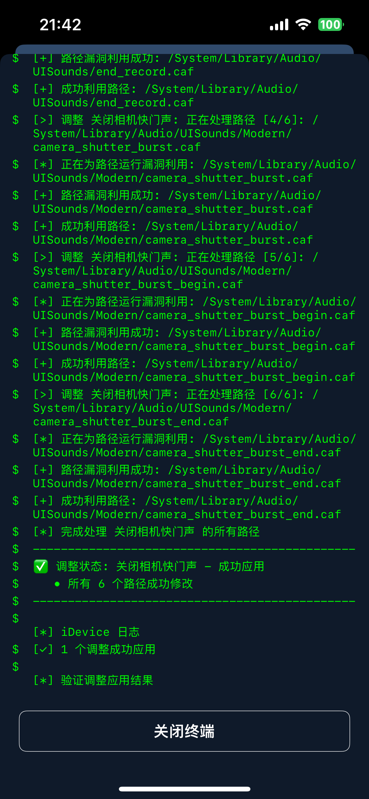

## iDevice ？

基于Google Project Zero的Ian Beer发现的强大漏洞[CVE-2025-24203](https://project-zero.issues.chromium.org/issues/391518636)**无需越狱**进行系统级调整
- ✅ iOS 16.0 – iOS 18.3.2 使用CVE-2025-24203
- ✅ iOS 16.0 - 18.5 支持文件管理器和IPA调整注入器

<!-- 图片左右排列 -->

    
    
    
    

